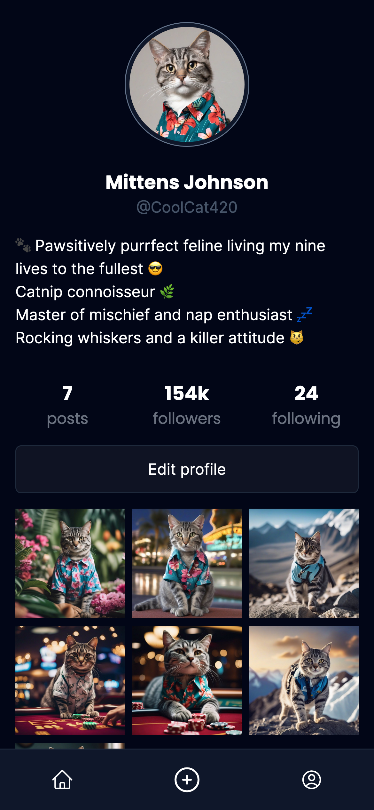

<h1 align="center">
  
   
  SnapCat - The Ultimate Cat Social Media
</h1>

<h4 align="center">Mock Social Media for Cats, Powered by React, TypeScript, React Router, Vite, and Tailwind CSS</h4>

  <a href="#key-features">Key Features</a> •
  <a href="#how-to-use">How To Use</a> •
  <a href="#credits">Credits</a> •
  <a href="#related">Related</a> •
  <a href="#license">License</a>

## Key Features

- Provides a feline-friendly platform for cats to share their adorable pictures.
- Built with React, TypeScript, React Router, Vite, and Tailwind CSS for a modern and responsive user interface.
- Offers a parody experience of Instagram tailored for the cat community.

## How To Use

### Installation

1. Clone or download the latest version of SnapCat from [here](https://github.com/your-username/snapcat).
2. Navigate to the project directory in your terminal.
3. Install dependencies with `npm install` or `yarn install`.
4. Start the development server with `npm run dev` or `yarn dev`.
5. Open your browser and go to `http://localhost:3000` to experience SnapCat.

### Features

1. Explore the "Purr-feed" to discover the latest cat posts.
2. Upload your cat's pictures with witty captions.
3. Like, comment, and share your favorite cat moments.
4. Set up a purr-sonal profile for your furry friend.

## Credits

- Data generated with [ChatGPT](https://chat.openai.com/).
- Images generated with [SDXL](https://huggingface.co/spaces/google/sdxl).

## Related

- [FSU23D - Frontend Development](https://github.com/thejoltjoker/FSU23D-frameworks) - Welcome to my GitHub repository for the frameworks system development course during my education as a full-stack developer at Medieinstitutet, FSU23D.

## You may also like...

- [Vad sa Maria från Teams egentligen?](https://github.com/thejoltjoker/vad-sa-maria-fran-teams-egentligen) - A mock chat app to determine the similarity between two string. 

- [React webshop frontend](https://github.com/thejoltjoker/react-webshop-frontend) -  A simple webshop to practice React 

## License

This project is licensed under the [MIT License](LICENSE).

